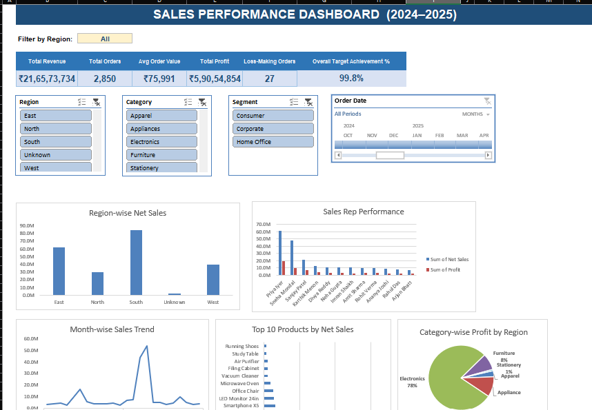
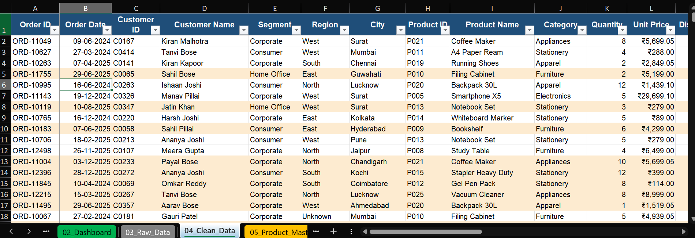
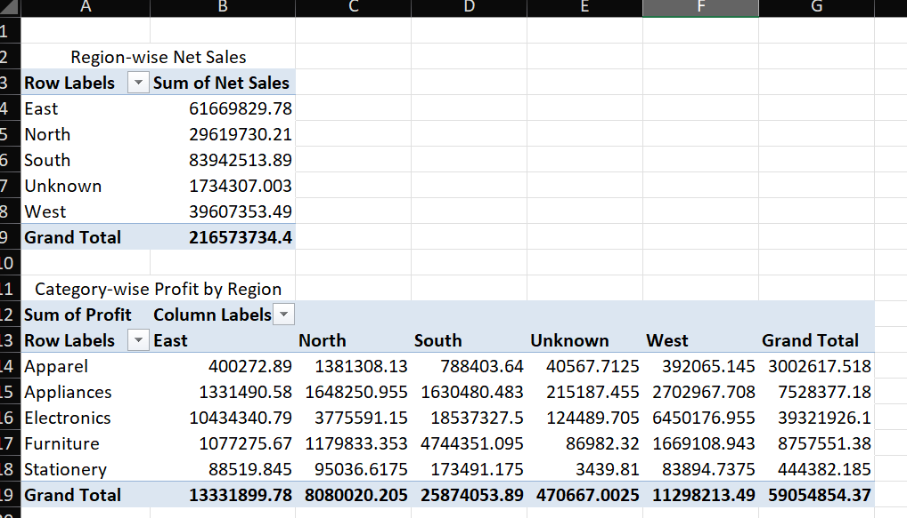

<div align="center">

# -- ! Sales Performance Excel Dashboard ! --
### *End-to-End Excel Project — Data Cleaning, Formulas, Pivot Tables & Interactive Dashboard*

[](https://www.microsoft.com/excel)
[](https://www.microsoft.com/excel)
[](https://www.microsoft.com/excel)
[](https://www.microsoft.com/excel)

<br/>

> *"Raw data tells a story — a good dashboard just knows how to read it out loud."*

</div>

---

## 📋 Table of Contents

- [📌 Overview](#-overview)
- [🎯 Problem Statement](#-problem-statement)
- [✨ Key Features](#-key-features)
- [🏗️ Project Structure](#️-project-structure)
- [🔄 Project Workflow](#-project-workflow)
- [🧹 Part A — Data Cleaning & Preparation](#-part-a--data-cleaning--preparation)
- [🧮 Part B — Formulas & Calculated Columns](#-part-b--formulas--calculated-columns)
- [📊 Part C — Pivot Tables & Dashboard](#-part-c--pivot-tables--dashboard)
- [🖼️ Screenshots](#️-screenshots)
- [🛠️ Tech Stack](#️-tech-stack)
- [📈 Results & Insights](#-results--insights)
- [🏆 Advantages](#-advantages)
- [📄 License](#-license)
- [👤 Author](#-author)
- [🙏 Acknowledgements](#-acknowledgements)

---

## 📌 Overview

The **Sales Performance Excel Dashboard** is an end-to-end Excel project built on a raw 3,000-row sales dataset. It demonstrates practical, real-world Excel skills — **data cleaning, formula-driven calculated columns, lookup functions, pivot tables with slicers, and an interactive KPI dashboard** — all inside a single workbook.

This project is designed to:
- Turn a messy, real-world dataset into a clean, analysis-ready table
- Apply formulas such as VLOOKUP, INDEX-MATCH, nested IF, SUMIFS, COUNTIFS and AVERAGEIFS
- Build dynamic Pivot Tables driven by Slicers and a Timeline control
- Present the final insights through a single-page, filterable dashboard

---

## 🎯 Problem Statement

> **Objective:** Clean a raw sales dataset and turn it into an interactive, decision-ready Excel dashboard.

The workbook starts with a 3,000-row raw export containing duplicates, missing values, inconsistent text, and mixed date/number formats. The task is to clean this data, enrich it with calculated formula columns (profit, profit %, sales rep details, order classification, etc.), summarize it using Pivot Tables, and present it as a single-page dashboard with KPI cards, filters, slicers, and charts.

| 📂 Feature | 📄 Type | 🔍 Description |
|------------|---------|----------------|
| Data Cleaning | Preparation | De-duplication, missing value handling, text/date standardization |
| Calculated Columns | Formulas | VLOOKUP, INDEX-MATCH, nested IF, Data Quality Flag |
| Pivot Tables | Summary | Region-wise Net Sales, Category-wise Profit by Region |
| Dashboard | Visualization | KPI cards, filters, slicers, timeline, charts |

The goal is to demonstrate **end-to-end Excel data analysis skills** through a single, well-documented workbook.

---

## ✨ Key Features

| Feature | Description |
|--------|-------------|
| 🧹 **Clean Data Pipeline** | Raw 3,000-row data cleaned down to 2,850 rows in a named Excel Table (`tblSales`) |
| 🔎 **Lookup Formulas** | VLOOKUP (Product Master) and INDEX-MATCH (Sales Rep Master) used to enrich every order |
| 🧮 **Nested IF Logic** | Order Size, Profit Status, Delivery Flag and Quarter derived through formulas |
| 📊 **Interactive Pivot Tables** | Region-wise Net Sales and Category-wise Profit by Region, controlled with Slicers & Timeline |
| 🖥️ **KPI Dashboard** | Total Revenue, Total Orders, Avg Order Value, Total Profit, Loss-Making Orders, Target Achievement % |
| 🎛️ **Filters & Slicers** | Region, Category, Segment and Order Date slicers drive every chart on the dashboard |
| 📐 **Data Quality Flag** | Formula-based flag catches negative or unusually large Quantity values |
| ✅ **Documented Assumptions** | Every cleaning decision and assumption logged in the Documentation sheet |

---

## 🏗️ Project Structure

```
📦 PriyaShihora_ExcelDashboard/
│
├── 📊 PriyaShihora_ExcelDashboard.xlsx   ← Main Excel workbook (entry point)
├── 🖼️ 1.Dashboard.png                    ← Dashboard screenshot
├── 🖼️ 2.Dataset.png                      ← Cleaned dataset screenshot
├── 🖼️ 3.pivot_table.png                  ← Pivot Table screenshot
│
└── 📄 README.md                          ← Project documentation
```

**Sheets inside the workbook:**

| Sheet | Purpose |
|-------|---------|
| `01_Documentation` | Project documentation — sheet index, data dictionary, cleaning log, formulas, assumptions |
| `02_Dashboard` | Interactive dashboard — KPI cards, Region filter dropdown, slicers, timeline, dynamic charts |
| `03_Raw_Data` | Original 3,000-row dataset as imported — untouched, kept for audit trail |
| `04_Clean_Data` | Cleaned data (2,850 rows) + all calculated formula columns — named Table `tblSales` |
| `05_Product_Master` | Product ID → Category, Cost Price, MRP (used by VLOOKUP) |
| `06_SalesRep_Master` | Sales Rep ID → Name, Region, Manager, Annual Target (used by INDEX-MATCH) |
| `07_Region_Target` | Region-wise yearly sales target, used for the Target Achievement KPI |
| `08_Pivot_Actual` | Interactive Sales Pivot Tables with Slicers and Timeline controls |
| `09_Charts` | All 5 dashboard charts in one place |

---

## 🔄 Project Workflow

```
Raw Data Import (3,000 rows)
      │
      ▼
┌─────────────────────────────┐
│   Data Cleaning & Dedup      │  ← 150 duplicates removed, blanks handled
└────────────┬─────────────────┘
             │
             ▼
┌─────────────────────────────┐
│  Calculated Columns          │  ← VLOOKUP, INDEX-MATCH, nested IF
│  (Clean_Data — 2,850 rows)   │
└────────────┬─────────────────┘
             │
     ┌───────┴────────┐
     ▼                ▼
┌─────────────┐   ┌──────────────────┐
│ Pivot Tables│   │  Master Sheets    │
│ + Slicers   │   │ (Product / Rep /  │
│ + Timeline  │   │  Region Target)   │
└──────┬──────┘   └────────┬─────────┘
       │                   │
       └─────────┬─────────┘
                  ▼
       ┌─────────────────────┐
       │   Charts (09_Charts) │
       └──────────┬───────────┘
                  ▼
       ┌─────────────────────┐
       │  02_Dashboard         │
       │  KPI Cards + Filters  │
       └──────────┬───────────┘
                  ▼
           Final Dashboard ✅
```

---

## 🧹 Part A — Data Cleaning & Preparation

### 📝 1. What Was Cleaned?

The raw export (`03_Raw_Data`) had duplicate rows, missing fields, inconsistent text casing, three different date formats, and text-formatted numbers. All of this was cleaned into `04_Clean_Data`.

### 🧾 2. Cleaning Log

| Issue | Action Taken |
|-------|-------------|
| Duplicate rows | 150 exact duplicate rows removed |
| Missing Region / Payment Mode | Filled with "Unknown" / "Not Specified" |
| Missing Segment / City | Recovered from another row with the same Customer ID first; remaining blanks set to "Unknown" |
| Missing / zero Unit Price | Filled from Product Master MRP |
| Missing Quantity | Set to 1 (documented assumption) |
| Missing Shipping Days | Filled with the column average, rounded |
| Missing / invalid Customer Rating (0, 6, 7) | Left blank rather than guessed |
| Inconsistent text (case, spacing) | Trimmed and standardized to Title Case |
| Inconsistent Payment Mode spelling | Mapped to 6 standard values |
| Text dates (3 formats) | Parsed to real Excel dates |
| Text numbers (commas/spaces) | Converted to numeric |
| Outlier Quantity (negative or > 300) | Kept but flagged "Check" in Data Quality Flag |

---

## 🧮 Part B — Formulas & Calculated Columns

### 🔍 3. Formulas Used (Examples)

| Type | Example |
|------|---------|
| VLOOKUP | `IFERROR(VLOOKUP(H2,'05_Product_Master'!$A:$E,4,FALSE),0)` |
| INDEX-MATCH | `INDEX('06_SalesRep_Master'!$B:$B,MATCH(P2,'06_SalesRep_Master'!$A:$A,0))` |
| Nested IF | `IF(Net Sales>50000,"High",IF(Net Sales>10000,"Medium","Low"))` |
| SUMIFS | `SUMIFS(tblSales[Net Sales],tblSales[Region],"North")` |
| COUNTIFS | `COUNTIFS(tblSales[Profit Status],"Loss")` |
| AVERAGEIFS | `AVERAGEIFS(tblSales[Customer Rating],tblSales[Sales Rep Name],"...")` |
| IFERROR | Wraps every lookup/division formula so a missing match shows 0 instead of an error |

**Key Calculated Columns:** Gross Sales → Discount → Net Sales → Cost (VLOOKUP) → Profit → Profit %, plus Sales Rep Name/Manager (INDEX-MATCH), Order Size/Profit Status/Delivery Flag/Quarter (nested IF), and Month (`TEXT(Order Date,"mmm-yy")`).

---

## 📊 Part C — Pivot Tables & Dashboard

### 🔢 4. Pivot Table Summaries

Built on `08_Pivot_Actual` using `tblSales` as the source, refreshed via Slicers and a Timeline control.

**Region-wise Net Sales:**

| Region | Sum of Net Sales |
|--------|------------------|
| East | ₹6,16,69,829.78 |
| North | ₹2,96,19,730.21 |
| South | ₹8,39,42,513.89 |
| Unknown | ₹17,34,307.00 |
| West | ₹3,96,07,353.49 |
| **Grand Total** | **₹21,65,73,734.40** |

**Category-wise Profit by Region (Grand Total):**

| Category | Total Profit |
|----------|-------------|
| Apparel | ₹30,02,617.52 |
| Appliances | ₹75,28,377.18 |
| Electronics | ₹3,93,21,926.10 |
| Furniture | ₹87,57,551.38 |
| Stationery | ₹4,44,382.19 |
| **Grand Total** | **₹5,90,54,854.37** |

### 🖥️ 5. How to Use the Dashboard

1. Go to `02_Dashboard`.
2. Use the **Filter by Region** dropdown — all 5 KPI cards recalculate instantly for the selected region.
3. Use the **Region / Category / Segment / Order Date** slicers and timeline — every chart updates together.
4. Charts are linked to `08_Pivot_Actual` and refresh whenever `04_Clean_Data` changes (press **F9** if Excel calculation is set to manual).
5. To add new orders, type them into new rows below the `tblSales` table on `04_Clean_Data` — the table auto-expands and every formula, pivot table and chart picks it up automatically.

---

## 🖼️ Screenshots

### 1. Dashboard


*Single-page KPI dashboard with Region/Category/Segment filters, an Order Date timeline, and 5 linked charts — Region-wise Net Sales, Sales Rep Performance, Month-wise Sales Trend, Top 10 Products by Net Sales, and Category-wise Profit by Region.*

### 2. Dataset


*Cleaned dataset (`04_Clean_Data`) as a named Excel Table — Order ID, Order Date, Customer & Product details, Category, Quantity, Unit Price and further calculated columns.*

### 3. Pivot Table


*Region-wise Net Sales and Category-wise Profit by Region pivot tables, built on `08_Pivot_Actual`.*

---

## 🛠️ Tech Stack

| Tool | Purpose |
|------|---------|
| 📊 **Microsoft Excel** | Core platform for the entire workbook |
| 📋 **Excel Tables** | `tblSales` — auto-expanding structured data source |
| 🔎 **VLOOKUP / INDEX-MATCH** | Lookup formulas across Product & Sales Rep master sheets |
| 🔀 **Nested IF** | Order classification and status logic |
| ➕ **SUMIFS / COUNTIFS / AVERAGEIFS** | Conditional aggregation for KPIs |
| 📈 **Pivot Tables, Slicers & Timeline** | Interactive data summarization and filtering |
| 📊 **Charts** | Bar, line and pie charts linked to Pivot Table output |

---

## 📈 Results & Insights

- ✅ **2,850 clean rows** — from a 3,000-row raw dataset, after removing 150 duplicates
- 💰 **₹21,65,73,734 Total Revenue** across 2,850 orders (Avg Order Value ≈ ₹75,991)
- 📊 **₹5,90,54,854 Total Profit**, with 27 loss-making orders flagged
- 🎯 **99.8% Overall Target Achievement** against region-wise yearly targets
- 🌍 **South region leads** in Net Sales, followed by East and West
- 🖥️ **Electronics dominates profit** at 78% of Category-wise Profit
- 🔁 **Fully dynamic dashboard** — every KPI, chart and pivot updates from filters/slicers without manual rework

---

## 🏆 Advantages

| Advantage | Detail |
|-----------|--------|
| 🎓 **Real-World Skill Demonstration** | Covers the full analyst workflow — clean, calculate, summarize, visualize |
| 🔄 **Reusability** | Add new rows to `tblSales` and every formula, pivot and chart updates automatically |
| 📚 **Fully Documented** | Cleaning log, data dictionary and assumptions all recorded in `01_Documentation` |
| 🖥️ **No Add-ins Needed** | Built entirely with native Excel features — no macros or external tools |
| ⚡ **Single Workbook** | Everything — raw data, clean data, masters, pivots, charts, dashboard — in one file |
| 🧪 **Extensible** | Easy to add new KPIs, charts or slicers as the dataset grows |
| 📖 **Audit-Friendly** | Raw data kept untouched on a separate sheet for traceability |
| 🛡️ **Data Quality Checks** | Formula-based flag catches outlier Quantity values automatically |

---

## 📄 License

This project is licensed under the **MIT License** — see the [LICENSE](LICENSE) file for full details.

```
MIT License — Free to use, modify, and distribute with attribution.
```

---

## 👤 Author

<div align="center">

### Priya Shihora

> *"Behind every good dashboard is a lot of cleaned-up data no one else ever sees."*

**🎓 Role:** Excel Data Analyst | Dashboard Developer \
**📍 Location:** India\
**🛠️ Skills:** Microsoft Excel · Data Cleaning · Pivot Tables · Dashboarding · Formula Logic

</div>

---

## 🙏 Acknowledgements

Special thanks to the following resources and communities that made this project possible:

- 📚 [Microsoft Excel Support](https://support.microsoft.com/en-us/excel) — Official Excel documentation
- 📊 [Exceljet](https://exceljet.net/) — Formula references and examples
- 📐 [Chandoo.org](https://chandoo.org/) — Dashboard design tutorials
- 🖥️ [Contextures](https://contexures.com/) — Pivot Tables, Slicers and Excel Table tips
- 💬 [Stack Overflow Community](https://stackoverflow.com/) — Problem-solving support
- 📖 [Kaggle Learn](https://www.kaggle.com/learn) — Data analysis fundamentals

---

<div align="center">

---

*Made with ❤️ and 📊 — Last updated: 18 September, 2026*

</div>
