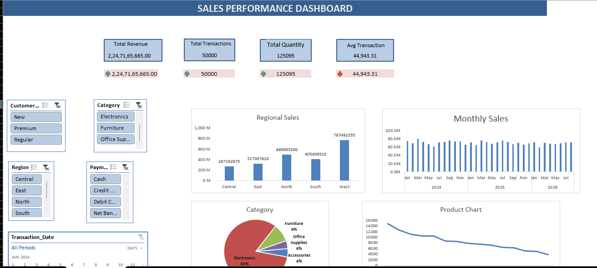
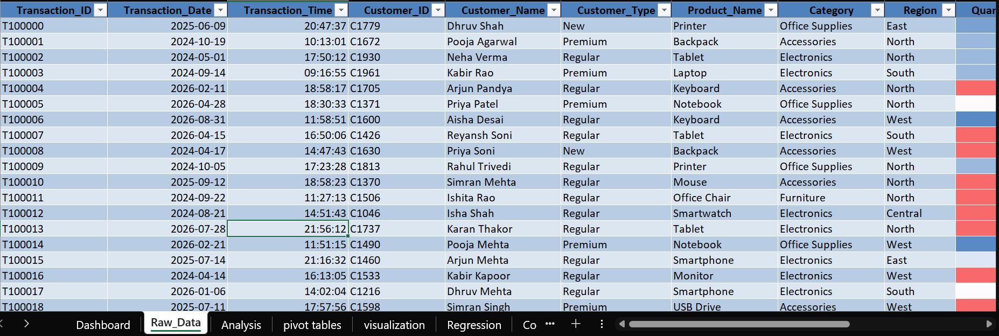
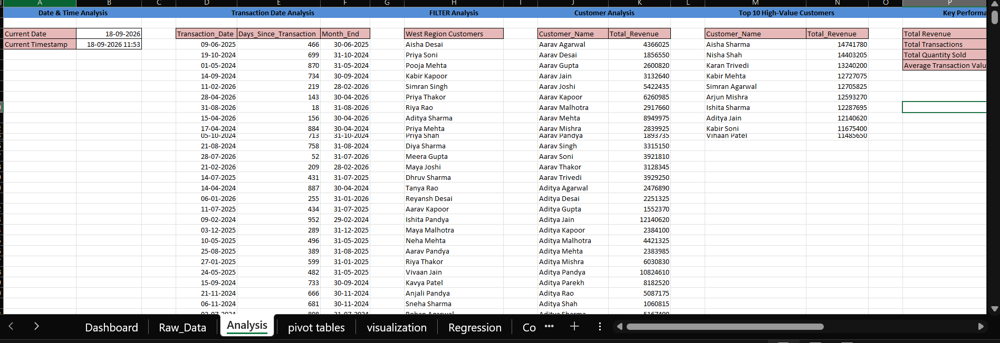
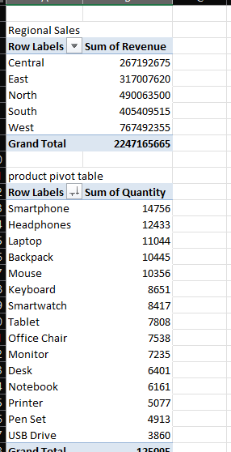

<div align="center">

# -- ! Customer Transaction Sales Analytics ! --
### *End-to-End Excel Project — Raw Data, Advanced Analysis, Pivot Tables, Regression & Interactive Dashboard*

[](https://www.microsoft.com/excel)
[](https://www.microsoft.com/excel)
[](https://www.microsoft.com/excel)
[](https://www.microsoft.com/excel)

<br/>

> *"50,000 transactions in, one dashboard out — that's the whole story of good analysis."*

</div>

---

## 📋 Table of Contents

- [📌 Overview](#-overview)
- [🎯 Problem Statement](#-problem-statement)
- [✨ Key Features](#-key-features)
- [🏗️ Project Structure](#️-project-structure)
- [🔄 Project Workflow](#-project-workflow)
- [🧾 Part A — Raw Data](#-part-a--raw-data)
- [🧮 Part B — Analysis Sheet](#-part-b--analysis-sheet)
- [📊 Part C — Pivot Tables](#-part-c--pivot-tables)
- [📉 Part D — Regression & What-If Analysis](#-part-d--regression--what-if-analysis)
- [🖥️ Part E — Dashboard](#️-part-e--dashboard)
- [🖼️ Screenshots](#️-screenshots)
- [🛠️ Tech Stack](#️-tech-stack)
- [📈 Results & Insights](#-results--insights)
- [🏆 Advantages](#-advantages)
- [📄 License](#-license)
- [👤 Author](#-author)
- [🙏 Acknowledgements](#-acknowledgements)

---

## 📌 Overview

The **Customer Transaction Sales Analytics** project is an end-to-end Excel workbook built on a 50,000-row customer transaction dataset. It goes beyond basic reporting — combining **raw data, formula-driven analysis, pivot tables, regression modeling, what-if/goal-seek scenarios, and an interactive dashboard** — all inside a single file.

This project is designed to:
- Analyze large-scale transaction data (50,000 rows) using Excel formulas and functions
- Break down sales by Region, Category, Product and Customer
- Model the relationship between Quantity and Revenue using Regression
- Run What-If and Goal Seek scenarios to test revenue targets
- Present the final insights through a single-page, filterable KPI dashboard

---

## 🎯 Problem Statement

> **Objective:** Analyze 50,000 customer transactions and turn them into an interactive, decision-ready Excel dashboard.

The workbook starts with a large transaction-level export (Transaction ID, Date, Time, Customer, Product, Category, Region, Quantity, Unit Price, Discount, Revenue, Payment Method, Salesperson). The task is to analyze this data using date/time functions, filters, customer ranking, pivot tables, regression and what-if analysis, and present it as a single-page dashboard with KPI cards, slicers, and charts.

| 📂 Feature | 📄 Type | 🔍 Description |
|------------|---------|----------------|
| Raw Data | Source | 50,000-row transaction-level dataset |
| Analysis | Formulas | Date/time, filter, customer & product analysis, KPIs |
| Pivot Tables | Summary | Regional, product, category and monthly sales pivots |
| Regression & What-If | Statistical | Quantity vs Revenue regression, Goal Seek, Scenario Summary |
| Dashboard | Visualization | KPI cards, filters, slicers, charts |

The goal is to demonstrate **advanced Excel data analysis skills** — from raw data to statistical modeling to visualization — in a single well-organized workbook.

---

## ✨ Key Features

| Feature | Description |
|--------|-------------|
| 📥 **Large Dataset Handling** | 50,000 transaction rows analyzed directly inside Excel |
| 🕒 **Date & Time Analysis** | Days Since Transaction, Month-End dates, current date/timestamp functions |
| 🔎 **FILTER Function Analysis** | Dynamic FILTER-based Region-wise customer lists |
| 🏆 **Top 10 High-Value Customers** | Ranked customer revenue analysis |
| 📊 **Multiple Pivot Tables** | Regional Sales, Product Quantity, Category Revenue, Monthly Sales Trend |
| 📉 **Regression Analysis** | Quantity vs Revenue regression with full ANOVA & coefficient output |
| 🎯 **What-If & Goal Seek** | Target revenue back-solved for required transaction count |
| 🧮 **Scenario Summary** | Low / Normal / High sales scenarios compared side by side |
| 🖥️ **KPI Dashboard** | Total Revenue, Total Transactions, Total Quantity, Avg Transaction Value |
| 🎛️ **Slicers & Timeline** | Customer Type, Category, Region, Payment Method and Transaction Date filters |

---

## 🏗️ Project Structure

```
📦 CustomerTransaction_ExcelProject/
│
├── 📊 customer_transaction.xlsx   ← Main Excel workbook (entry point)
├── 🖼️ 1_Dashboard.png             ← Dashboard screenshot
├── 🖼️ 2_Dataset.png               ← Raw dataset screenshot
├── 🖼️ 3_Analysis.png              ← Analysis sheet screenshot
├── 🖼️ 4_pivot_table.png           ← Pivot Table screenshot
│
└── 📄 README.md                   ← Project documentation
```

**Sheets inside the workbook:**

| Sheet | Purpose |
|-------|---------|
| `Dashboard` | Interactive dashboard — KPI cards, Customer/Category/Region/Payment slicers, Transaction Date timeline, charts |
| `Raw_Data` | Original 50,000-row transaction dataset — Transaction ID, Date, Time, Customer, Product, Category, Region, Quantity, Price, Discount, Revenue, Payment Method, Salesperson |
| `Analysis` | Date & Time Analysis, FILTER Analysis, Customer Analysis, Top 10 High-Value Customers, KPIs, Product Analysis, Repeating Customer Analysis, Regional Sales, Text Function Analysis |
| `pivot tables` | Regional Sales, Product Pivot Table, Category Pivot Table, Monthly Sales Pivot |
| `visualization` | Supporting chart sheet |
| `Regression` | Regression Summary Output — Quantity vs Revenue (R Square, ANOVA, Coefficients) |
| `Comparison_Lists` | List A vs List B customer name matching |
| `Scenario Summary` | Low / Normal / High sales scenario comparison |
| `What_If_Analysis` | Goal Seek — transactions required to hit a target revenue |
| `Final_report` | Consolidated final report |

---

## 🔄 Project Workflow

```
Raw Transaction Data (50,000 rows)
      │
      ▼
┌─────────────────────────────┐
│   Analysis Sheet             │  ← Date/Time, FILTER, Customer & Product analysis
└────────────┬─────────────────┘
             │
     ┌───────┴────────┐
     ▼                ▼
┌─────────────┐   ┌──────────────────┐
│ Pivot Tables│   │ Regression &      │
│ (Region /   │   │ What-If / Goal    │
│ Product /   │   │ Seek / Scenario   │
│ Category /  │   │ Summary           │
│ Month)      │   │                    │
└──────┬──────┘   └────────┬─────────┘
       │                   │
       └─────────┬─────────┘
                  ▼
       ┌─────────────────────┐
       │   Visualization       │
       └──────────┬───────────┘
                  ▼
       ┌─────────────────────┐
       │   Dashboard            │
       │  KPI Cards + Filters   │
       └──────────┬───────────┘
                  ▼
       ┌─────────────────────┐
       │   Final_report         │
       └──────────┬───────────┘
                  ▼
           Final Insights ✅
```

---

## 🧾 Part A — Raw Data

### 📝 1. Dataset Overview

`Raw_Data` holds 50,000 transaction rows with the following columns:

| Column | Description |
|--------|-------------|
| Transaction_ID | Unique transaction identifier (e.g. T100000) |
| Transaction_Date / Transaction_Time | Date and time of the transaction |
| Customer_ID / Customer_Name / Customer_Type | Customer identity — New, Premium, Regular |
| Product_Name / Category | Product sold and its category |
| Region | Central / East / North / South / West |
| Quantity / Unit_Price / Discount_% / Revenue | Transaction value fields |
| Payment_Method | Cash, Credit Card, Debit Card, Net Banking |
| Salesperson / Created_Timestamp | Sales attribution and record timestamp |

---

## 🧮 Part B — Analysis Sheet

### 🔍 2. Analysis Blocks

The `Analysis` sheet breaks the raw data down into multiple focused blocks:

| Block | Purpose |
|-------|---------|
| Date & Time Analysis | Current date/timestamp, dynamic reference points |
| Transaction Date Analysis | Days Since Transaction, Month-End date for every transaction |
| FILTER Analysis | Dynamic Region-wise customer list using the `FILTER` function |
| Customer Analysis | Total revenue per customer |
| Top 10 High-Value Customers | Ranked list of the highest-spending customers |
| Key Performance Indicators | Total Revenue, Total Transactions, Total Quantity Sold, Avg Transaction Value |
| Product Analysis / Most Sold Product | Product-level performance and best sellers |
| Repeating Customer Analysis | Identifies customers with more than one transaction |
| Regional Sales | Revenue rolled up by Region |
| Text Function Analysis | Text-based formulas applied to customer/product fields |

---

## 📊 Part C — Pivot Tables

### 🔢 3. Pivot Table Summaries

Built on the `pivot tables` sheet from the raw transaction data.

**Regional Sales (Sum of Revenue):**

| Region | Sum of Revenue |
|--------|----------------|
| Central | ₹26,71,92,675 |
| East | ₹31,70,07,620 |
| North | ₹49,00,63,500 |
| South | ₹40,54,09,515 |
| West | ₹76,74,92,355 |
| **Grand Total** | **₹2,24,71,65,665** |

**Category-wise Sum of Revenue:**

| Category | Sum of Revenue |
|----------|----------------|
| Accessories | ₹9,54,81,940 |
| Electronics | ₹1,85,76,74,705 |
| Furniture | ₹20,43,72,580 |
| Office Supplies | ₹8,96,36,440 |
| **Grand Total** | **₹2,24,71,65,665** |

**Top Products by Sum of Quantity:** Smartphone (14,756) leads, followed by Headphones (12,433) and Laptop (11,044) — 15 products tracked, totalling 1,25,095 units sold.

**Monthly Sales Pivot:** Revenue tracked month-by-month across **2024 (₹85.74 Cr), 2025 (₹84.20 Cr) and 2026 (₹54.77 Cr, partial year)**.

---

## 📉 Part D — Regression & What-If Analysis

### 📐 4. Regression Summary (Quantity vs Revenue)

| Statistic | Value |
|-----------|-------|
| Multiple R | 0.419 |
| R Square | 0.176 |
| Observations | 50,000 |
| Significance F | ~0 (highly significant) |
| Quantity Coefficient | 17,944.49 (P-value ≈ 0) |

Quantity is a statistically significant predictor of Revenue, though it explains only part of the total variance (R² ≈ 0.18) — indicating other factors (Category, Region, Discount) also drive revenue.

### 🎯 5. What-If & Goal Seek

| Metric | Value |
|--------|-------|
| Current Transactions | 50,000 |
| Average Transaction Value | ₹44,943.31 |
| Estimated Revenue | ₹22,47,16,566 |
| Target Revenue (Goal Seek) | ₹1,00,00,000 |
| Transactions Needed | ≈ 223 |

### 🧮 6. Scenario Summary

| Scenario | Transactions | Resulting Revenue |
|----------|-------------|-------------------|
| Low Sales | 150 | ₹67,41,497 |
| Normal Sales | ≈ 223 | ₹1,00,00,000 |
| High Sales | 300 | ₹1,34,82,994 |

---

## 🖥️ Part E — Dashboard

### 7. How to Use the Dashboard

1. Open the `Dashboard` sheet — KPI cards show **Total Revenue, Total Transactions, Total Quantity, Avg Transaction Value**.
2. Use the **Customer Type, Category, Region and Payment Method** slicers, plus the **Transaction Date** timeline — every chart updates together.
3. Charts include Regional Sales, Monthly Sales trend, Category breakdown (pie), and Product Chart (top-selling products).
4. To add new transactions, extend the `Raw_Data` sheet — pivot tables and charts refresh on **Refresh All / F9**.

---

## 🖼️ Screenshots

### 1. Dashboard


*KPI dashboard with Total Revenue, Total Transactions, Total Quantity and Avg Transaction Value cards, driven by Customer/Category/Region/Payment slicers and a Transaction Date timeline, with Regional Sales, Monthly Sales, Category and Product charts.*

### 2. Dataset


*Raw 50,000-row transaction dataset (`Raw_Data`) — Transaction ID, Date, Time, Customer, Product, Category, Region, Quantity and further fields.*

### 3. Analysis


*`Analysis` sheet — Date & Time Analysis, FILTER Analysis, Customer Analysis, Top 10 High-Value Customers and Key Performance Indicators.*

### 4. Pivot Table


*Regional Sales and Product Pivot Tables built on the transaction data.*

---

## 🛠️ Tech Stack

| Tool | Purpose |
|------|---------|
| 📊 **Microsoft Excel** | Core platform for the entire workbook |
| 🔎 **FILTER Function** | Dynamic Region-wise customer filtering |
| 🕒 **Date & Time Functions** | Days Since Transaction, Month-End calculations |
| 📈 **Pivot Tables, Slicers & Timeline** | Interactive data summarization and filtering |
| 📉 **Regression Analysis (Data Analysis ToolPak)** | Quantity vs Revenue statistical modeling |
| 🎯 **Goal Seek & Scenario Manager** | What-if analysis for target revenue |
| 📊 **Charts** | Bar, line and pie charts linked to Pivot Table output |

---

## 📈 Results & Insights

- 💰 **₹2,24,71,65,665 Total Revenue** across 50,000 transactions (Avg Transaction Value ≈ ₹44,943.31)
- 🌍 **West region leads** in revenue (₹76.75 Cr), followed by North and South
- 📦 **Smartphone is the top-selling product** by quantity (14,756 units)
- 🖥️ **Electronics dominates category revenue** at ~82.6% of total revenue
- 📉 **Regression confirms** Quantity significantly predicts Revenue (P-value ≈ 0), though other factors also contribute (R² ≈ 0.18)
- 🎯 **Goal Seek shows** only ~223 transactions at average value are needed to hit a ₹1 Cr revenue target
- 🔁 **Fully dynamic dashboard** — every KPI, chart and pivot updates from filters/slicers without manual rework

---

## 🏆 Advantages

| Advantage | Detail |
|-----------|--------|
| 🎓 **Advanced Skill Demonstration** | Covers raw data, formulas, pivots, regression and dashboarding in one project |
| 📥 **Scales to Large Data** | Handles 50,000 rows smoothly using Tables, Pivots and FILTER |
| 📚 **Statistically Grounded** | Regression output backs up business insights with real statistics |
| 🎯 **Scenario Planning Built-In** | Goal Seek and Scenario Manager support target-setting decisions |
| 🖥️ **Single Workbook** | Raw data, analysis, pivots, regression, what-if and dashboard all in one file |
| 🧪 **Extensible** | Easy to add new KPIs, charts, slicers or scenarios as data grows |
| 📖 **Well-Organized** | Each analytical step lives on its own clearly named sheet |
| 🛡️ **Decision-Ready** | Final_report sheet consolidates the key findings for stakeholders |

---

## 📄 License

This project is licensed under the **MIT License** — see the [LICENSE](LICENSE) file for full details.

```
MIT License — Free to use, modify, and distribute with attribution.
```

---

## 👤 Author

<div align="center">

### Priya Shihora

> *"Fifty thousand rows of data don't mean much until someone asks the right questions of them."*

**🎓 Role:** Excel Data Analyst | Dashboard & Analytics Developer \
**📍 Location:** India\
**🛠️ Skills:** Microsoft Excel · Pivot Tables · Regression Analysis · What-If Analysis · Dashboarding

</div>

---

## 🙏 Acknowledgements

Special thanks to the following resources and communities that made this project possible:

- 📚 [Microsoft Excel Support](https://support.microsoft.com/en-us/excel) — Official Excel documentation
- 📊 [Exceljet](https://exceljet.net/) — Formula and function references
- 📐 [Chandoo.org](https://chandoo.org/) — Dashboard design tutorials
- 📉 [Corporate Finance Institute](https://corporatefinanceinstitute.com/) — Regression & What-If Analysis concepts
- 🖥️ [Contextures](https://contexures.com/) — Pivot Tables, Slicers and Scenario Manager tips
- 💬 [Stack Overflow Community](https://stackoverflow.com/) — Problem-solving support
- 📖 [Kaggle Learn](https://www.kaggle.com/learn) — Data analysis fundamentals

---

<div align="center">

---

*Made with ❤️ and 📊 — Last updated: 18 September, 2026*

</div>
